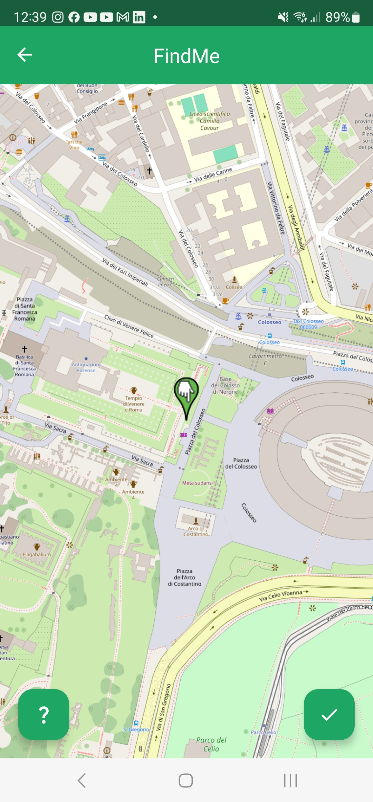
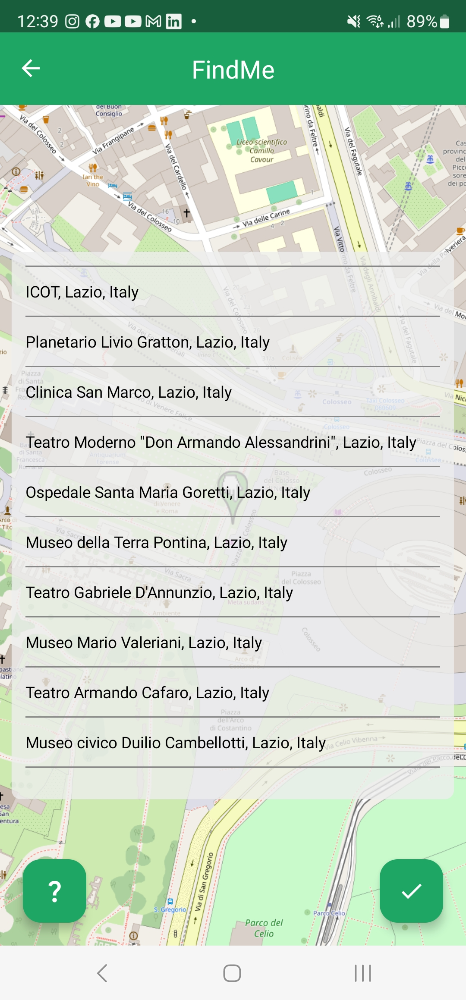

<b>FindMe</b> is a fun and engaging mobile application that challenges users to guess locations based on photos posted by others. It combines social interaction with a gaming twist, as players navigate through a map to pinpoint the exact spot of the uploaded photo. The game tests geographical knowledge and offers a fun way to learn about new places!

This is a project made for the 2022-2023 course on [Mobile Applications and Cloud Computing](https://sites.google.com/diag.uniroma1.it/beraldi/mobile-applications-and-cloud-computing-23).

## Features

- <b>Photo Sharing</b>: Users can upload photos of their current locations.
- <b>Guessing Game</b>: Players guess the location of each photo using a world map.
- <b>Hints</b>: Receive hints about nearby landmarks or notable features to help pinpoint the location!
- <b>Distance-Based Scoring</b>: Points are awarded based on how close the guess is to the actual location. The closer you are, the lower your score, with the goal of achieving the smallest possible score.
- <b>Global Leaderboard</b>: Scores are averaged across all guesses to rank users globally, promoting consistent accuracy in guesses.
- <b>Interactive Map</b>: Utilize an interactive map interface to pinpoint your guesses.
- <b>Multilingual Support</b>: Fully localized interface in English and Italian to cater to a diverse user base.

## Technical Architecture

FindMe follows the MVVM (Model-View-ViewModel) architecture complemented by Repository and DataSource patterns to ensure clean, manageable, and scalable code.

## Screenshots

| Guess the place | List of hints |
|-|-|
|  |  |

## Installation

To get started with FindMe, you will need to set up your own instance of the server. The repository containing the server code will be made available soon.
